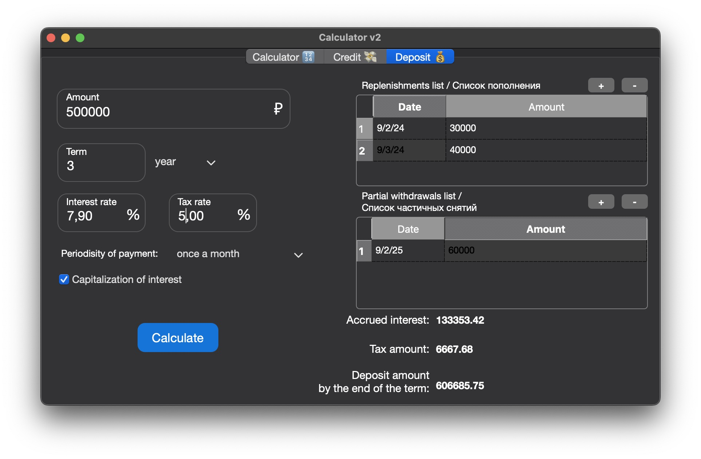

# Calculator_v2

An extended version of calculator in C++ and credit &amp; deposit calculator

## Introduction

This project aims to develop an enhanced calculator, designed using structured programming principles and implemented in the C++ programming language. This extended calculator, beyond the standard arithmetic operations found in typical operating system applications, offers the capability to evaluate complex arithmetic expressions following the appropriate order of operations. Additionally, it includes various mathematical functions, such as sine, cosine, and logarithms.

In addition to its mathematical capabilities, this calculator supports the use of a variable _x_ and facilitates the graphical representation of corresponding functions.

Furthermore, the project considers a credit and deposit calculator.

#### Calculator:


#### Credit calculator:


#### Deposit calculator:



### Technologies

\- stack / queue / vector \
\- Qt \
\- reverse Polish notation \
\- Dijkstra's algorithm \
\- test with googletest \
\- gcov report

## Installing

**1.** Clone project

```
git clone https://github.com/awesic/Calculator_v2.git
```

**2.** Go to the `src/Calculator_v2` folder

```
cd src/Calculator_v2
```

**3.** Install calculator

> ❗️ first of all, you should install `qmake` (for install), `gtest` (for tests), `lcov` (for coverage report).

```
make install
```

### QMake install

**Mac OS**

```
brew install qt6
```

**Linux**

QMake is likely part of your distribution’s packages. Use the following commands to search for the most recent version:

**Debian / Ubuntu:** apt search qmake \
**RedHat Enterprise Linux / CentOS / Fedora:** yum provides \*bin/qmake\*

**Windows**

Download Qt from https://www.qt.io/download.

**4.** Open Calculator app in the src/build folder, app named `Calculator_v2` and enjoy

**Mac OS**

```
open build/Calculator_v2.app
```

**Linux**

```
./build/Calculator_v2
```

## Targets in Makefile

**all**: \
&nbsp; &nbsp; &nbsp; &nbsp; make all this targets: clean uninstall dist tests install dvi

**install**: \
&nbsp; &nbsp; &nbsp; &nbsp; install the calculator to `build` folder

**uninstall**: \
&nbsp; &nbsp; &nbsp; &nbsp; delete the `build` folder

**clean**: \
&nbsp; &nbsp; &nbsp; &nbsp; remove all object and executable files

**dvi**: \
&nbsp; &nbsp; &nbsp; &nbsp; its like mini documantation (html file)

**dist**: \
&nbsp; &nbsp; &nbsp; &nbsp; make tar archieve from project

**test**: \
&nbsp; &nbsp; &nbsp; &nbsp; run tests

**style_check**: \
&nbsp; &nbsp; &nbsp; &nbsp; check code style (Google style)

**style_fix**: \
 &nbsp; &nbsp; &nbsp; &nbsp; fix code style
